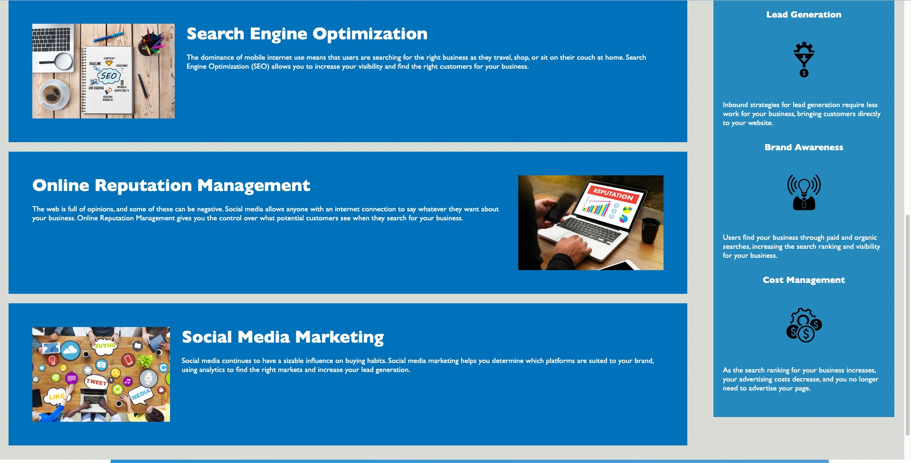

# Web Accessibility

## Description
 
 The motivation of this project was to refactor already existing code to help aid in accessibility. Before being refactored, the code did not contain any semantic elements as well as any alt attributes. This project was designed to help in writing 'cleaner' code as well as keeping in line with the semantics of today. In doing so, I have learned how to properly 'group' together lines of code in their respective categories. 

## Installation

N/A

## Usage
Screenshots of Live Website:

Link to Live Website:

http://127.0.0.1:5501/index.html 

## Credits

N/A

## License

N/A 
